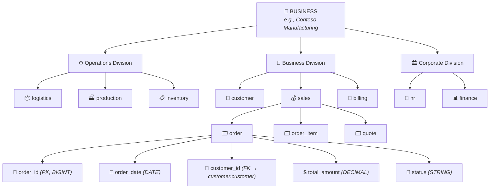
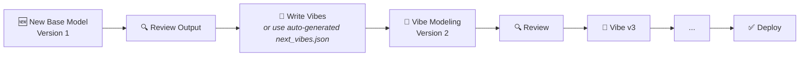

<div align="center">

# Databricks Vibe Modelling Agent

### Generate production-grade enterprise data models from natural language

[](#)
[](#)
[](#)
[](#)

*Describe your business. Get a data model. Vibe it until it's perfect.*

---

[Concepts](#-concepts) · [Getting Started](#-getting-started) · [Widget Reference](#-widget-reference) · [Vibing Workflow](#-the-vibing-workflow) · [Action Catalog](#-the-complete-action-catalog) · [Troubleshooting](#-troubleshooting)

</div>

---

## Table of Contents

- [What Is Vibe Modelling?](#what-is-vibe-modelling)
- [Concepts](#-concepts)
  - [Industry Data Models vs. Business Data Models](#industry-data-models-vs-business-data-models)
  - [The Four-Level Hierarchy](#the-four-level-hierarchy-divisions--domains--products--attributes)
  - [DAG Enforcement](#dag-enforcement--no-circular-dependencies)
  - [Single Source of Truth (SSOT)](#single-source-of-truth-ssot)
  - [Model Scopes: MVM vs. ECM](#model-scopes-mvm-vs-ecm)
  - [Industry Complexity Tiers](#industry-complexity-tiers)
- [Getting Started](#-getting-started)
  - [Quick Start Recipes](#quick-start-recipes)
- [Operations](#-operations)
- [The Vibing Workflow](#-the-vibing-workflow)
- [Widget Reference](#-widget-reference)
  - [Core Widgets (01–11)](#core-configuration-widgets-0111)
  - [Convention Widgets (12–24)](#model-convention-widgets-1224)
- [Context File Format](#-context-file-format)
- [The Complete Action Catalog](#-the-complete-action-catalog)
- [Pipeline Stages](#-pipeline-stages)
- [Output Artifacts](#-output-artifacts)
- [Quality Rules & Enforcement](#-quality-rules--enforcement)
- [LLM Architecture](#-llm-architecture)
- [Metric Views](#-metric-views)
- [Troubleshooting](#-troubleshooting)
- [Glossary](#-glossary)

---

## What Is Vibe Modelling?

Vibe Modelling is a Databricks-native, LLM-powered approach to generating enterprise data models from natural language. Instead of manually drawing ER diagrams, writing DDL, or importing pre-built industry templates, you describe your business in plain English and the agent builds a complete, production-grade data model — domains, tables, columns, foreign keys, tags, sample data, and documentation — end to end.

The name **"Vibe"** reflects the core workflow:

> **Generate a base model → review → vibe it with natural language → repeat → deploy**

Each iteration produces a new version. The agent carries forward your context so nothing is lost between runs. You are never locked into a static template — the model evolves with your business.

---

## 📖 Concepts

### Industry Data Models vs. Business Data Models

<details>
<summary><b>What is an Industry Data Model?</b></summary>

An **industry data model** is a generic, one-size-fits-all template designed for an entire vertical — retail, banking, healthcare, telecoms, etc. Organizations like the TM Forum (telecoms), ARTS (retail), ACORD (insurance), and HL7 (healthcare) publish canonical schemas that attempt to cover every conceivable entity and relationship across the industry.

**The problem:** When you adopt an industry model, you inherit everything — including the 60–80% of tables that your business will never use. You then spend months trimming, renaming, and reshaping the model to fit your actual processes.
</details>

<details>
<summary><b>What is a Business Data Model?</b></summary>

A **business data model** is tailored, contextualized, and specific to YOUR organization. It reflects your actual business processes, your product lines, your org structure, your regulatory environment, your terminology, and your governance requirements.

**Vibe Modelling generates business data models.** The LLM understands your industry deeply (via the complexity tier system), but the model it produces is shaped entirely by your context.
</details>

| Aspect | Industry Data Model | Business Data Model (Vibe) |
|:---|:---|:---|
| **Scope** | Entire industry vertical | Your specific business |
| **Customization** | Post-delivery (manual pruning) | Built-in (LLM-driven from your context) |
| **Relevance** | 20–40% directly applicable | 90–100% directly applicable |
| **Time to production** | Months of adaptation work | Hours with iterative vibing |
| **Naming** | Committee-standard naming | Your business terminology and conventions |
| **Evolution** | New version = re-adoption | Vibe the next version from the previous one |
| **Cost** | License fees + adaptation labor | Compute cost of LLM generation |

### The Vibe Philosophy

```
1. GENERATE  →  Describe your business, get a base model
2. VIBE IT   →  Review output, provide natural-language refinements
3. REPEAT    →  Each iteration = new version; agent auto-suggests next vibes
4. DEPLOY    →  Physical Unity Catalog schemas, tables, FKs, tags, sample data
```

---

### The Four-Level Hierarchy: Divisions → Domains → Products → Attributes

Every Vibe model follows a strict four-level hierarchy:



#### Level 1: Divisions

Divisions are the top-level organizational grouping. Every domain belongs to exactly one division.

| Division | Purpose | Typical Domains |
|:---|:---|:---|
| **Operations** | Core operational backbone — mechanisms, infrastructure, processes | Logistics, production, inventory, service delivery, supply chain, quality control |
| **Business** | Revenue-generating and customer-facing functions | Customer/party, billing/revenue, product catalog, sales, subscriptions |
| **Corporate** | Supporting functions for governance (NOT directly revenue-generating) | HR, finance, legal/compliance, marketing, procurement, IT |

> **Division Balance Rules:**
> - Operations + Business MUST be **>= 80%** of all domains
> - Corporate is capped at **<= 20%** of total domains
> - No Corporate domain allowed until Operations **AND** Business each have >= 2 domains

#### Level 2: Domains

A **domain** is a logical grouping of related data products (tables). When deployed, each domain maps 1:1 to a Unity Catalog **schema**.

- Named in `snake_case` (e.g., `customer_management`, `order_fulfillment`)
- Count depends on model scope (MVM vs ECM) and industry complexity tier
- The `shared` domain is **reserved** — the pipeline auto-creates it during SSOT consolidation; never create it manually

#### Level 3: Products (Tables)

A **product** is a data table within a domain — a first-class business entity with its own identity, lifecycle, and attributes.

- Every product gets a PK column: `<product_name>_<pk_suffix>` (default: `<product_name>_id`)
- Classified as **CORE** (entities stakeholders query directly) or **HELPER** (supporting entities)
- Tagged by data type: `master_data` | `transactional_data` | `reference_data` | `association_table`

> **The First-Class Entity Test:** A product must have its own identity, its own lifecycle, and at least 5 unique business attributes. Anything less should be an attribute on another table or merged.

#### Level 4: Attributes (Columns)

Each attribute has:

| Property | Example | Purpose |
|:---|:---|:---|
| `attribute` | `customer_email` | Column name (snake_case) |
| `type` | `STRING` | Apache Spark SQL data type |
| `tags` | `restricted,pii_email` | Classification + PII tags |
| `value_regex` | `^[a-zA-Z0-9._%+-]+@` | Validation pattern or enum |
| `business_glossary_term` | `Customer Email Address` | Human-readable business name |
| `description` | `Primary contact email for the customer` | What this attribute represents |
| `reference` | `GDPR Article 6` | Regulatory or standard reference |
| `foreign_key_to` | `customer.customer.customer_id` | FK target (`domain.product.pk`), or empty |

---

### DAG Enforcement — No Circular Dependencies

FK relationships **MUST** form a **Directed Acyclic Graph (DAG)**:

```
✅ VALID:   order → customer → address
❌ INVALID: order → customer → address → order  (cycle!)
```

**Why it matters:** Circular dependencies prevent clean data loading order, break ETL pipelines, and indicate modeling errors.

**How the agent enforces it:**

1. **Detect** — Python DFS (Depth-First Search) cycle detection during QA
2. **Break** — LLM Cycle Break specialist determines which FK to remove (always the weakest link)
3. **Verify** — Re-run DFS to confirm graph is now a valid DAG
4. **Iterate** — Up to 5 rounds to resolve all cycles, including residual ones

> **Allowed exception:** Self-referencing hierarchical FKs (e.g., `parent_category_id → category.category_id`) are permitted — they represent tree structures, not multi-node cycles.

---

### Single Source of Truth (SSOT)

> **Each core business concept has exactly ONE authoritative domain and ONE authoritative product (table) that owns it. No concept is duplicated across domains.**

**What SSOT prevents:**
- Two `customer` tables in different domains
- A `product` table in both `sales` and `inventory`
- An `invoice` table in both `billing` and `finance`

**How SSOT is enforced:**

| Phase | Mechanism |
|:---|:---|
| **Generation** | LLM places each entity in its *authoritative* domain — the domain that CREATES/OWNS that data |
| **QA Deduplication** | Global pass detects same-name products + synonym pairs (e.g., `customer` vs `client`) with 60%+ attribute overlap |
| **Consolidation** | Overlapping products merged into `shared` domain with discriminator column |
| **Cross-Domain References** | Other domains use FK columns to reference the authoritative table — no duplication |

> **The "Where Do I Go?" Test:** For any entity, ask: *"If a business user needs this information, is there exactly ONE place to get it?"* If the answer is ambiguous, there is an SSOT violation.

---

### Model Scopes: MVM vs. ECM

| | MVM (Minimum Viable Model) | ECM (Expanded Coverage Model) |
|:---|:---|:---|
| **Size** | 30–50% of ECM table count | Full coverage |
| **Attribute depth** | **SAME as ECM** — full production-grade | Full production-grade |
| **Domains** | Essential business functions only | All functions including corporate back-office |
| **Ideal for** | SMBs, rapid deployments, POCs, dev/test | Fortune 100, multinational enterprises |
| **Lightness** | Fewer domains & tables (NEVER thinner attributes) | Maximum breadth |

> MVM is NOT a skeleton or demo toy. It is a production-ready subset where every delivered table is fully-featured.

### Industry Complexity Tiers

The agent auto-classifies your business into one of five tiers:

| Tier | Label | Hallmarks | ECM Domains | ECM Products/Domain |
|:---|:---|:---|:---:|:---:|
| `tier_1` | **Ultra-Complex** | 5+ regulatory bodies, multi-entity structures (banking, insurance, pharma) | 15–22 | 14–28 |
| `tier_2` | **Complex** | 2–4 regulatory bodies, multi-channel (telecoms, energy, healthcare) | 12–18 | 14–26 |
| `tier_3` | **Moderate** | 1–2 regulatory bodies, 3+ business functions (manufacturing, retail) | 10–15 | 12–24 |
| `tier_4` | **Standard** | Light regulation, regional complexity (logistics, agriculture) | 8–12 | 10–20 |
| `tier_5` | **Simple** | Minimal regulation, service-based (consulting, SaaS, media) | 5–8 | 8–18 |

MVM counts are automatically derived as ~30–50% of the ECM counts for each tier. Attribute depth (min/max attributes per product) is **the same** for both MVM and ECM within each tier.

---

## 🚀 Getting Started

### Quick Start Recipes

<details>
<summary><b>Recipe 1: Generate Your First Model (Minimal Input)</b></summary>

| Widget | Value |
|:---|:---|
| 01. Business | `My Company Name` |
| 02. Description | `A brief description of what your company does` |
| 03. Operation | `new base model` |
| 05. Model Scope | `Minimum Viable Model - MVM` |
| 09. Deployment Catalog | `my_catalog` *(or leave blank for logical-only)* |
| Everything else | Defaults |

Run the notebook. Done.
</details>

<details>
<summary><b>Recipe 2: Generate a Rich Model (Recommended)</b></summary>

| Widget | Value |
|:---|:---|
| 01. Business | `Contoso Manufacturing` |
| 02. Description | `A multinational aluminum smelting company operating across 12 countries with 15,000 employees` |
| 03. Operation | `new base model` |
| 05. Model Scope | `Expanded Coverage Model - ECM` |
| 06. Business Domains | `production, quality_control, supply_chain, customer, sales, logistics, billing` |
| 07. Org Divisions | `Operations, Business and Corporate` |
| 09. Deployment Catalog | `contoso_dev` |
| 10. Sample Records | `10` |
</details>

<details>
<summary><b>Recipe 3: Vibe an Existing Model</b></summary>

| Widget | Value |
|:---|:---|
| 03. Operation | `vibe modeling of version` |
| 04. Version | `1` |
| 08. Model Vibes | `Add a warranty domain. Remove the corporate_strategy domain. Run quality checks.` |
| 11. Context File | `/Volumes/catalog/schema/volume/vibes/contoso_business_context.json` |
</details>

<details>
<summary><b>Recipe 4: Use Auto-Generated Next Vibes</b></summary>

After any pipeline run, find `<business>_next_vibes.json` in the `vibes/` output folder.

| Widget | Value |
|:---|:---|
| 03. Operation | `vibe modeling of version` |
| 04. Version | Next version number (previous + 1) |
| 11. Context File | `/Volumes/catalog/schema/volume/vibes/contoso_next_vibes.json` |
| 08. Model Vibes | *(leave empty — vibes are inside the context file)* |
</details>

<details>
<summary><b>Recipe 5: Deploy to a New Catalog</b></summary>

| Widget | Value |
|:---|:---|
| 03. Operation | `install model` |
| 09. Deployment Catalog | `prod_catalog` |
| 11. Context File | `/Volumes/catalog/schema/volume/vibes/contoso_business_context.json` |
| 10. Sample Records | `0` *(or a number for test data)* |
</details>

---

## ⚙️ Operations

The `03. Operation` widget selects which pipeline mode to run:

| Operation | Purpose | Key Requirements |
|:---|:---|:---|
| **`new base model`** | Generate a brand-new data model from scratch | Business name + description |
| **`vibe modeling of version`** | Apply natural-language instructions to refine an existing version | Version + vibes (widget 08 or context file) |
| **`shrink ecm`** | Convert an ECM to a leaner MVM | Version + deployment catalog |
| **`enlarge mvm`** | Expand an MVM into a comprehensive ECM | Version + deployment catalog |
| **`install model`** | Deploy a logical model into physical Unity Catalog objects | Context file + deployment catalog |
| **`uninstall model version`** | Remove a version's physical artifacts from the catalog | Business name + version + catalog |
| **`generate sample data`** | Generate synthetic sample records for an existing deployed model | Context file + deployment catalog |

---

## 🎵 The Vibing Workflow

This is the core power of Vibe Modelling — iterative refinement via natural language:



### What Vibes Can Do

Vibes are **free-form natural language**. The agent interprets them and translates them into specific actions:

```
"Add a compliance domain with regulatory_filing and audit_trail tables"
"Remove the HR domain, we don't need it"
"Merge the customer_support domain into the customer domain"
"Add a source_system column to every table"
"Run a full quality check and fix any issues found"
"The order table should have a shipping_address_id FK to the address table"
"Rename all tables starting with dim_ to remove that prefix"
"Normalize the order domain to 3NF"
"Mark all email columns as PII"
"Generate an ontology (RDF/RDFS) for the model"
"Keep only billing-related tables, drop everything else"
"Make this model ECM — I need the large version"
```

### Auto-Generated Next Vibes

After **every** pipeline run, the agent produces `<business>_next_vibes.json` containing:

- Your current business context (preserved as-is)
- **Recommended vibes** for the next iteration (based on QA findings)
- Model health metadata: confidence score, warning counts, issue breakdown
- Version history and progression tracking

To use it: point widget **11. Context File** to this file, set operation to `vibe modeling of version`, set the next version, and run.

---

## 🎛️ Widget Reference

The notebook exposes **24 configurable widgets**. Below is the complete reference.

### Core Configuration Widgets (01–11)

| # | Widget | Type | Mandatory | Default | Description |
|:---:|:---|:---:|:---:|:---:|:---|
| **01** | **Business (name)** | Text | **Yes**<sup>1</sup> | — | Your business/organization name |
| **02** | **Description** | Text | Recommended | — | What your business does (richer = better model) |
| **03** | **Operation** | Dropdown | **Yes** | `new base model` | Pipeline operation to run |
| **04** | **Version** | Dropdown | Conditional<sup>2</sup> | — | Model version number (1–100) |
| **05** | **Model Scope** | Dropdown | **Yes** | `Minimum Viable Model - MVM` | MVM (lean) or ECM (comprehensive) |
| **06** | **Business Domains** | Text | No | — | Comma-separated seed domains |
| **07** | **Included Org Divisions** | Dropdown | **Yes** | `Operations and Business` | Which divisions to include |
| **08** | **Model Vibes** | Text | Conditional<sup>3</sup> | — | Natural language instructions or path to vibes.txt |
| **09** | **Deployment Catalog** | Text | Conditional<sup>4</sup> | — | Unity Catalog for physical deployment |
| **10** | **Sample Records** | Dropdown | No | `0` | Synthetic records per table (0 = none) |
| **11** | **Context File** | Text | Conditional<sup>5</sup> | — | Path to business context JSON file |

<sup>1</sup> Not required when context file provides it.
<sup>2</sup> Required for all operations except `new base model` (auto-assigned).
<sup>3</sup> Required for `vibe modeling of version` (unless vibes are in the context file).
<sup>4</sup> Required for `install`, `uninstall`, `generate sample data`, `shrink`, `enlarge`. Optional for `new base model` and `vibe modeling`.
<sup>5</sup> Required for `install model`, `generate sample data`. Recommended for `vibe modeling of version`.

<details>
<summary><b>Detailed Widget Descriptions (click to expand)</b></summary>

#### 01. Business (name)
The name of your business. Used as the top-level identifier across the entire model. Case-insensitive matching (stored via `LOWER()`). If a context file provides a business name, it takes precedence.

**Sample values:** `Contoso Inc`, `Acme Healthcare`, `Global Telecom Corp`, `NextGen Retail`

#### 02. Description
A rich description of what your business does. Include industry, size, geography, key products/services. The LLM uses this to determine the industry complexity tier and tailor the model.

**Sample values:** `A multinational aluminum smelting and manufacturing company operating across 12 countries`, `A digital-first healthcare provider specializing in telemedicine`

#### 03. Operation
**Options:** `new base model` | `vibe modeling of version` | `shrink ecm` | `enlarge mvm` | `install model` | `uninstall model version` | `generate sample data`

See the [Operations](#-operations) section for full details on each mode.

#### 04. Version
**Options:** Empty, or `1`–`100`

For `new base model`, leave empty — auto-assigned as `1` (or auto-incremented). For `vibe modeling of version`, this is the version you are modifying; output creates version N+1.

#### 05. Model Scope
**Options:** `Minimum Viable Model - MVM` | `Expanded Coverage Model - ECM`

MVM = lean core (fewer domains/tables, same attribute depth). ECM = comprehensive Fortune 100 coverage.

#### 06. Business Domains
Comma-separated list of specific domains you want. If blank, the LLM auto-generates the optimal set for your industry.

**Sample values:** `customer, sales, billing, inventory, logistics` | `patient_care, pharmacy, clinical_trials`

#### 07. Included Org Divisions
**Options:** `Operations` | `Operations and Business` | `Operations, Business and Corporate`

Controls which organizational divisions contribute domains to the model.

#### 08. Model Vibes
Write inline instructions **OR** provide a file path (`/Volumes/.../vibes.txt`). See [The Vibing Workflow](#-the-vibing-workflow) for examples.

#### 09. Deployment Catalog
The Unity Catalog where physical schemas, tables, FK constraints, tags, and sample data will be created. Must already exist. You need `CREATE SCHEMA` privileges. If blank for `new base model`/`vibe modeling`, only the logical model (JSON artifacts) is produced.

**Sample values:** `dev_catalog`, `prod_data_models`, `contoso_lakehouse`

#### 10. Sample Records
**Options:** `0`, `5`, `10`, `15`, `20`, `25`, `50`, `100`

`0` = skip sample data generation. `10` = good default for review. `50`–`100` = for load testing / demos. Sample data respects FK relationships (child records reference valid parent IDs).

#### 11. Context File
Path to a JSON file containing business context, model conventions, and/or vibe instructions. After every run, the agent generates `_next_vibes.json` — point here for the next iteration.

**Sample values:** `/Volumes/my_catalog/my_schema/vol/vibes/contoso_business_context.json`
</details>

### Model Convention Widgets (12–24)

| # | Widget | Type | Default | Options / Format |
|:---:|:---|:---:|:---:|:---|
| **12** | Naming Convention | Dropdown | `snake_case` | `snake_case`, `camelCase`, `PascalCase`, `SCREAMING_CASE` |
| **13** | Primary Key Suffix | Dropdown | `_id` | `_id`, `_key`, `_pk`, `id`, `key` |
| **15** | Schema Prefix | Text | *(empty)* | e.g., `stg_`, `raw_`, `dw_` |
| **16** | Tag Prefix | Text | `dbx_` | e.g., `dbx_`, `vibe_`, `mdl_` |
| **17** | Table ID Type | Dropdown | `BIGINT` | `BIGINT`, `INT`, `LONG`, `STRING` |
| **18** | Boolean Format | Dropdown | `Boolean (True/False)` | `Boolean (True/False)`, `Int (0/1)`, `String (Y/N)` |
| **19** | Date Format | Dropdown | `yyyy-MM-dd` | `yyyy-MM-dd`, `dd/MM/yyyy`, `MM/dd/yyyy`, `yyyy/MM/dd`, `dd-MM-yyyy` |
| **20** | Timestamp Format | Dropdown | `yyyy-MM-dd'T'HH:mm:ss.SSSXXX` | 4 ISO/standard options |
| **21** | Classification Levels | Text | `restricted=restricted, confidential=confidential, internal=Internal, public=public` | Comma-separated `key=Label` pairs |
| **22** | Housekeeping Columns | Dropdown | `No` | `No`, `Yes` — adds `created_by`, `created_at`, `updated_by`, `updated_at` |
| **23** | History Tracking Columns | Dropdown | `No` | `No`, `Yes` — adds `valid_from`, `valid_to`, `is_current` (SCD Type 2) |
| **24** | Vibe Session ID | Text | *(empty)* | UUID for external UI progress tracking |

---

## 📄 Context File Format

The context file is a JSON document — the most powerful way to configure a run. It can provide business context, model conventions, and vibe instructions all in one place.

### Structure

```json
{
  "user_config": {
    "operation": "vibe modeling of version",
    "model_version": "2",
    "data_model_scopes": "Minimum Viable Model - MVM",
    "deployment_catalog": "my_catalog",
    "generate_samples": "10"
  },
  "business_context": {
    "business_information": {
      "business": "Contoso Manufacturing",
      "description": "A multinational aluminum smelting and manufacturing company",
      "industry_alignment": "Industrial Manufacturing - Aluminum Smelting",
      "core_business_processes": "Smelting, casting, rolling, extrusion, recycling",
      "orgnaization_divisions": "operations, business, corporate",
      "data_domains": "production, quality_control, supply_chain, customer, sales",
      "common_business_jargons": "pot=electrolytic cell, potline=row of pots, tap=metal extraction",
      "operational_systems_of_records": "SAP ERP, OSIsoft PI, MES System, LIMS",
      "industry_governing_body": "Aluminum Association, ISO 9001, EPA regulations"
    },
    "model_conventions": {
      "data_asset_naming_convention": "snake_case",
      "primary_key_suffix": "_id",
      "tag_prefix": "dbx_",
      "table_id_type": "BIGINT",
      "boolean_format": "Boolean (True/False)",
      "date_format": "yyyy-MM-dd",
      "timestamp_format": "yyyy-MM-dd'T'HH:mm:ss.SSSXXX"
    },
    "vibe_modelling_instructions": "Add a sustainability domain. Remove corporate_strategy. Ensure production tables have shift_id FK."
  }
}
```

### Section Reference

| Section | Purpose |
|:---|:---|
| `user_config` | Widget-equivalent settings. Values here **override** widget values. |
| `business_context.business_information` | Rich business context fed to the LLM |
| `business_context.model_conventions` | Naming and formatting conventions |
| `business_context.vibe_modelling_instructions` | Natural language instructions |

### Business Information Fields

| Field | What to Provide |
|:---|:---|
| `business` | Your business name |
| `description` | What your business does — **the richer, the better** |
| `industry_alignment` | Your specific industry (drives complexity tier classification) |
| `core_business_processes` | Comma-separated key processes |
| `orgnaization_divisions` | `operations, business, corporate` (which to model) |
| `data_domains` | Seed domains (optional — LLM generates if empty) |
| `common_business_jargons` | `abbreviation=definition` pairs for industry terminology |
| `operational_systems_of_records` | Source systems (SAP, Salesforce, custom apps, etc.) |
| `industry_governing_body` | Regulatory bodies and standards |

### Auto-Generated Next Vibes File

After every run, the agent produces `<business>_next_vibes.json` which extends the structure above with:

```json
{
  "_next_vibe_metadata": {
    "generated_from_version": "v1_mvm",
    "model_version": "1",
    "status": "needs_work",
    "confidence_score": 78,
    "summary": "Model has 3 unlinked columns and 1 siloed table",
    "issues_addressed": ["..."],
    "issues_not_addressed": ["..."],
    "data_modeler_notes": "Recommend adding a warehouse domain",
    "model_stats_at_generation": { "domains": 8, "products": 47, "attributes": 523 },
    "issue_counts": { "error": 0, "warning": 3, "info": 5 },
    "version_history": ["..."]
  }
}
```

---

## 🎯 The Complete Action Catalog

Vibes are translated into **190+ specific actions** organized into categories. You never need to name these actions — just describe what you want in natural language and the agent maps your intent.

<details>
<summary><b>Entity Management (1–25)</b></summary>

| # | Action | What It Does |
|:---:|:---|:---|
| 1 | `drop` | Remove a domain, product, attribute, tag, or link |
| 2 | `create` | Add a new domain, product, or attribute |
| 3 | `rename` | Change the name of an entity |
| 4 | `alter_description` | Modify the description |
| 5 | `change_type` | Change an attribute's data type |
| 6 | `merge` | Combine two entities into one |
| 7 | `split` | Divide one entity into multiple |
| 8 | `move_product` | Move a product to another domain |
| 9 | `move_attribute` | Move an attribute to another product |
| 10 | `delete_attribute` | Remove an attribute |
| 11 | `create_link` | Create a foreign key relationship |
| 12 | `drop_link` | Remove a foreign key relationship |
| 13–17 | Prefix/suffix ops | Add, remove, or change name prefixes/suffixes |
| 18–24 | Metadata ops | Update glossary terms, references, regex, tags |
| 25 | `modify` | Regenerate an entity with specific guidance |
</details>

<details>
<summary><b>Quality Check & Analysis (26–38)</b></summary>

| # | Action | What It Does |
|:---:|:---|:---|
| 26 | `run_quality_checks` | **Compound:** runs detect_duplicates + dedupe_attributes + detect_cycles + detect_siloed + fix_fk_anomalies |
| 26b | `run_product_domain_fit` | LLM audit: are products in the right domains? Relocates misplaced ones. |
| 27 | `detect_duplicates` | Find SSOT violations (semantic duplicate products across domains) |
| 28 | `fix_duplicates` | Auto-merge/remove detected duplicates |
| 29 | `dedupe_attributes` | Remove duplicate columns within products |
| 30 | `detect_cycles` | Find circular FK dependencies |
| 31 | `break_cycles` | Auto-fix cycles by removing weakest FK links |
| 32 | `detect_siloed` | Find completely disconnected tables (no FKs in any direction) |
| 33 | `fix_siloed` | Connect disconnected tables via linking attempts |
| 34 | `review_links` | Audit all FK relationships for anomalies |
| 35 | `fix_fk_anomalies` | Repair broken, mismatched, or orphaned FK references |
| 36 | `fix_ambiguous_fks` | Resolve FKs that match multiple target tables |
| 37 | `merge_small_tables` | Analyze and consolidate tables with < 5 attributes |
| 38 | `identify_core_products` | Identify business-critical products for protection |
| 95 | `model_checkup` | **Mega-compound:** runs static analysis + auto-queues ALL appropriate fixes |
</details>

<details>
<summary><b>FK & Linking Operations (39–46, 133–138)</b></summary>

| # | Action | What It Does |
|:---:|:---|:---|
| 39 | `run_linking` | **Compound:** in-domain + cross-domain + M:N detection |
| 40 | `run_in_domain_linking` | Link FKs within each domain |
| 41 | `run_cross_domain_linking` | Link FKs across different domains |
| 42 | `detect_many_to_many` | Find potential M:N relationships |
| 43 | `create_junction_tables` | Create bridge/association tables for M:N |
| 45 | `redirect_fk` | Redirect FK to a different target table |
| 46 | `find_unlinked_columns` | Find *_id columns without FK relationships |
| 133 | `remove_product_prefix` | Remove redundant table-name prefix from columns |
| 134 | `fix_fk_column_naming` | Fix FK columns that don't end with the target PK name |
| 135 | `connect_table` | Connect a specific disconnected table |
| 136 | `link_specific_columns` | Link an explicit list of unlinked _id columns |
| 138 | `find_missing_fk_links` | **Comprehensive:** LLM classifies each unlinked column as LINK, CREATE, DROP, or KEEP_AS_IS |
</details>

<details>
<summary><b>Bulk Operations (62–64, 110–114)</b></summary>

| # | Action | What It Does |
|:---:|:---|:---|
| 62 | `bulk_rename_products` | Rename multiple products by pattern |
| 63 | `bulk_drop_products` | Drop products matching a pattern (e.g., `stg_*`) |
| 64 | `bulk_move_products` | Move products matching a pattern to another domain |
| 110 | `bulk_change_type` | Change data type for attributes by pattern |
| 111 | `bulk_set_nullable` | Set nullable for attributes by pattern |
| 113 | `bulk_remove_attributes` | Remove attributes matching a pattern from all tables |
</details>

<details>
<summary><b>Tag & Classification Operations (54–61, 98–106, 156–163)</b></summary>

| # | Action | What It Does |
|:---:|:---|:---|
| 54–57 | Tag add/remove | Add or remove tags from products or domains |
| 58 | `conditional_tag` | Tag entities matching a condition |
| 59–60 | Bulk tagging | Tag by name pattern or by column presence |
| 98–101 | PII/sensitive marking | Mark as PII, sensitive, encrypted, deprecated |
| 103 | `set_table_type` | Classify as dimension, fact, lookup, bridge, staging, archive |
| 156 | `classify_table_tier` | Medallion architecture: bronze / silver / gold |
| 161 | `set_data_owner` | Assign data owner/steward |
| 162 | `set_update_frequency` | Document expected freshness (real_time, daily, monthly, etc.) |
| 163 | `map_to_source_system` | Map table/column to source system (SAP, Salesforce, etc.) |
</details>

<details>
<summary><b>Template Column Actions (148–155)</b></summary>

| # | Action | Columns Added |
|:---:|:---|:---|
| 148 | `add_scd_columns` | `effective_from`, `effective_to`, `is_current`, `row_hash` |
| 149 | `add_audit_columns` | `created_at`, `updated_at`, `created_by`, `updated_by` |
| 150 | `add_soft_delete_columns` | `is_deleted`, `deleted_at`, `deleted_by` |
| 151 | `add_temporal_columns` | `valid_from`, `valid_to`, `system_from`, `system_to` |
| 152 | `add_versioning_columns` | `version_number`, `version_valid_from`, `version_valid_to`, `is_latest_version` |
| 153 | `add_multitenancy_columns` | `tenant_id` |
| 154 | `add_lineage_columns` | `source_system`, `source_table`, `ingestion_timestamp`, `etl_job_id` |
| 155 | `add_gdpr_columns` | `consent_status`, `consent_date`, `data_subject_request_id`, `right_to_erasure_date` |
</details>

<details>
<summary><b>Structural Transformations (164–191)</b></summary>

| # | Action | What It Does |
|:---:|:---|:---|
| 164 | `normalize_to_3nf` | Apply Third Normal Form normalization (LLM-powered) |
| 165 | `denormalize_for_analytics` | Create wide/denormalized tables for BI |
| 184 | `promote_to_table` | Extract an attribute into its own lookup/reference table + FK |
| 185 | `inline_table` | Merge a child table into its parent (denormalize) |
| 186 | `swap_domains` | Atomically swap two domain names |
| 187 | `impact_analysis` | Show what would break if a table/domain were dropped (read-only) |
| 190 | `enlarge_model` | Wholesale expansion from MVM to ECM scope |
| 191 | `shrink_model` | Wholesale reduction from ECM to MVM scope |
| 178 | `VIBE_PRUNE_PROMPT` | LLM-powered: keep only tables related to a focus area |
| 179 | `drop_domains_except` | Drop all domains except a specified keep-list |
</details>

<details>
<summary><b>Artifact Generation (139–147)</b></summary>

| # | Action | Output |
|:---:|:---|:---|
| 139 | `generate_readme` | README documentation |
| 140 | `generate_data_model_json` | Complete model as JSON |
| 141 | `generate_ontology` | RDF/RDFS ontology (Turtle format) |
| 142 | `generate_dbml` | DBML schema for visualization tools |
| 143 | `generate_release_notes` | Changelog/release notes for the version |
| 144 | `generate_excel` | Excel workbook export |
| 145 | `generate_data_dictionary` | Comprehensive data dictionary |
| 146 | `export_model_report` | Full model documentation report |
| 147 | `generate_test_cases` | Data quality test case specifications |
</details>

<details>
<summary><b>Metric View Operations (126–134)</b></summary>

| # | Action | What It Does |
|:---:|:---|:---|
| 126 | `run_metric_modeling` | Generate Databricks metric views (dimensions + measures) |
| 129 | `add_metric_measure` | Add a specific KPI measure to metric views |
| 130 | `remove_metric_measure` | Remove a measure |
| 131 | `add_metric_dimension` | Add a grouping dimension |
| 132 | `remove_metric_dimension` | Remove a dimension |
| 133 | `alter_metric_filter` | Set/update metric view filter logic |
| 134 | `drop_metric_view` | Remove an entire metric view |
</details>

---

## 🔄 Pipeline Stages

When you run the agent, it executes these stages in order:

| # | Stage | Duration | What Happens |
|:---:|:---|:---:|:---|
| 1 | **Setup and Configuration** | 2–10s | Validates inputs, creates metamodel tables |
| 2 | **Collecting Business Context** | 10–30s | LLM enriches your description across 6 dimensions |
| 3 | **Interpreting Instructions** | 10–30s | *(Vibe mode only)* Parses vibes into structured action plan |
| 4 | **Designing Domains** | 15–60s | Generates domains following division model + SSOT |
| 5 | **Creating Data Products** | 1–10m | Products per domain with architect review |
| 6 | **Enriching with Attributes** | 5–40m | All columns for every product |
| 7 | **Cross-Domain Linking** | 1–5m | In-domain → global sweep → pairwise comparison |
| 8 | **Quality Assurance** | 30s–3m | 9 sub-checks (naming, PK/types, overlaps, topology, auto-remediation) |
| 9 | **Physical Schema Construction** | 1–10m | Creates UC schemas + Delta tables *(if catalog set)* |
| 10 | **Applying Foreign Keys** | 30s–2m | FK constraints on physical tables |
| 11 | **Applying Tags** | 2–15m | Classification, PII, data type tags on schemas/tables/columns |
| 12 | **Applying Metric Views** | 30s–5m | Databricks metric views for KPI tracking |
| 13 | **Generating Sample Data** | 1–15m | Synthetic records respecting FK relationships |
| 14 | **Generating Artifacts** | 30s–2m | README, Excel, JSON, data dictionary, model report |
| 15 | **Applying Naming Conventions** | 10–30s | Final consistency pass |
| 16 | **Consolidation and Cleanup** | 10–30s | Temporary artifact cleanup |
| 17 | **Model Finalization** | 10–30s | Final results, next vibes generation |
| 18 | **Metric View Artifacts** | 10–30s | Export metric view definitions |

---

## 📦 Output Artifacts

### Logical Artifacts (Always Generated)

| File | Description |
|:---|:---|
| `vibes/<business>_business_context.json` | Your business context (as-is copy, enriched by LLM) |
| `vibes/<business>_next_vibes.json` | Ready-to-use context file with recommended next vibes |
| `domains.json` | All domain definitions |
| `products.json` | All product (table) definitions |
| `attributes.json` | All attribute (column) definitions |
| `README.md` | Human-readable model documentation |
| `data_model.json` | Complete model export |
| `data_dictionary` | Column-level reference guide |
| `Excel/CSV export` | Spreadsheet of the entire model |
| `model_report` | Full documentation report |

### Physical Deployment (When Catalog Is Set)

| Object | Example |
|:---|:---|
| **Schemas** | `catalog.customer`, `catalog.sales`, `catalog.logistics` |
| **Tables** | Delta tables with all columns and correct Spark SQL types |
| **FK Constraints** | Physical foreign key constraints between tables |
| **Tags** | Unity Catalog tags on schemas, tables, and columns |
| **Metric Views** | Databricks metric views for KPI calculation |
| **Sample Data** | Synthetic records with valid FK references |

---

## 🛡️ Quality Rules & Enforcement

The agent enforces a comprehensive rule system during generation and QA:

| Rule Group | Key Rules |
|:---|:---|
| **Division Balance (G06)** | Ops + Business >= 80% of domains; Corporate <= 20%; no Corporate until Ops AND Business each have >= 2 |
| **SSOT (G07)** | One owning domain per concept; 60%+ overlap triggers merge; core products protected |
| **DAG Integrity (G05)** | No circular FK dependencies; DFS detection + LLM breaking; hierarchical self-refs exempt |
| **Naming (G03)** | Configured convention (default: snake_case); PK = `<table>_<suffix>`; FK must end with target PK name; no classification prefixes in names |
| **Attributes (G04)** | PK is first attribute; unique names within product; FK targets validated; PII = RESTRICTED + specific PII tag; count within min/max (25% buffer max) |
| **FK Quality (G05)** | In-domain → cross-domain → pairwise linking; M:N detected and resolved; anomalies auto-fixed |
| **Honesty Check (G11)** | Every LLM response self-scores 0–100; below threshold = rejected + retried; contradiction penalty applied post-processing |
| **Tags (G08)** | Domains tagged with division; products with data type; attributes with classification (only for sensitive data); PII tags: `pii_email`, `pii_phone`, `pii_financial`, `pii_health`, `pii_identifier`, `pii_address`, `pii_biometric` |

---

## 🤖 LLM Architecture

The agent uses a **multi-model ensemble** with automatic demotion:

| Role | Purpose | Models |
|:---|:---|:---|
| **Thinker** | Complex reasoning, architecture reviews, QA decisions | Claude Opus 4.6, Claude Opus 4.5 |
| **Worker (large)** | High-volume generation: products, attributes, FKs, dedup | Claude Sonnet 4.6, Claude Sonnet 4.5 |
| **Worker (small)** | Simpler tasks: domain generation, tag classification | GPT-OSS 120B |
| **Worker (tiny)** | Sample data generation | GPT-OSS 20B |

**Automatic model demotion:** If a model fails or returns low-quality results after N attempts (default: 3), the agent demotes to the next model in the priority chain. The pipeline always completes.

**Prompt architecture:** 40+ specialized prompts, each mapped to a specific model role and temperature setting. Thinker prompts use temperature 0 for deterministic reasoning. Sample generation uses temperature 0.5 for creative variety.

---

## 📊 Metric Views

The agent generates **Databricks metric views** — reusable KPI definitions that sit on top of your data tables:

| Component | Description | Example |
|:---|:---|:---|
| **Dimensions** | Grouping columns | `region`, `product_category`, `fiscal_quarter` |
| **Measures** | Single-aggregate expressions | `SUM(revenue)`, `COUNT(DISTINCT customer_id)`, `AVG(order_value)` |
| **Filters** | Row-level predicates | `WHERE status = 'completed'` |

Metric views are auto-generated per domain, focusing on KPIs that would appear in executive dashboards and quarterly business reviews. Each measure uses a **single aggregate function** (nested aggregates like `AVG(SUM(...))` are not supported by metric view YAML and are automatically prevented).

---

## 🔧 Troubleshooting

| Symptom | Likely Cause | Resolution |
|:---|:---|:---|
| *"No deployment catalog specified — skipping physical model deployment"* | Widget 09 is empty | Set deployment catalog to deploy physical tables |
| Model has too few domains | MVM scope + tier_5 classification | Switch to ECM, or provide seed domains in widget 06 |
| Model has irrelevant domains | LLM inferred from description | Vibe: `"Remove the X domain"` |
| FK pointing to wrong table | LLM linked incorrectly | Vibe: `"Redirect order.warehouse_id FK to logistics.warehouse"` |
| Circular dependency warning | DAG violation | Agent auto-fixes during QA; if persistent: `"Break cycles"` |
| SSOT violation (duplicate entities) | Same concept in multiple domains | Vibe: `"Run quality checks"` or `"Fix duplicates"` |
| Pipeline crashed mid-run | LLM timeout or transient error | Re-run with same inputs — agent cleans up incomplete versions |
| Context file parse error | Invalid JSON (smart quotes, trailing commas) | Validate JSON; use straight quotes only |
| *"Version X exists but is incomplete"* | Previous run failed | Agent auto-detects — just re-run |
| Model too large / too many tables | ECM + high complexity tier | Use `shrink ecm`, or vibe: `"Keep only core business tables"` |
| Convention changes not applied | Running vibe without context file | Provide context file with updated `model_conventions` |
| Metric views have `COUNT(1)` instead of real KPIs | Nested aggregates were auto-replaced | LLM prompt prevents this; re-run metrics: `"Regenerate metrics"` |

---

## 📘 Glossary

| Term | Definition |
|:---|:---|
| **Attribute** | A column in a product (table) — has name, type, tags, description |
| **Business Data Model** | A data model tailored to a specific organization, generated by Vibe Modelling |
| **Corporate Division** | Supporting functions (HR, Finance, Legal) that enable but don't directly generate revenue |
| **DAG** | Directed Acyclic Graph — the required topology for FK relationships (no cycles) |
| **Division** | Top-level organizational grouping: Operations, Business, or Corporate |
| **Domain** | A logical grouping of related tables, deployed as a Unity Catalog schema |
| **ECM** | Expanded Coverage Model — comprehensive enterprise-grade model scope |
| **FK** | Foreign Key — a column referencing another table's primary key |
| **Honesty Check** | LLM self-assessment score (0–100%) to ensure output quality |
| **Industry Data Model** | A generic, vendor-published schema template for an entire industry vertical |
| **Junction Table** | An association table resolving M:N relationships between two entities |
| **Metric View** | A Databricks KPI definition with dimensions, measures, and filters |
| **MVM** | Minimum Viable Model — lean, production-ready scope (30–50% of ECM) |
| **PK** | Primary Key — the unique identifier column for a table |
| **Product** | A data table within a domain — a first-class business entity |
| **SSOT** | Single Source of Truth — each business concept has one and only one authoritative owner |
| **Tier** | Industry complexity classification (tier_1 = Ultra-Complex to tier_5 = Simple) |
| **Vibe** | A natural language instruction provided to the agent to modify the model |
| **Vibe Modelling** | The iterative process of generating and refining data models using natural language |

---

<div align="center">

*Built on Databricks Serverless Compute with Unity Catalog governance*

</div>
